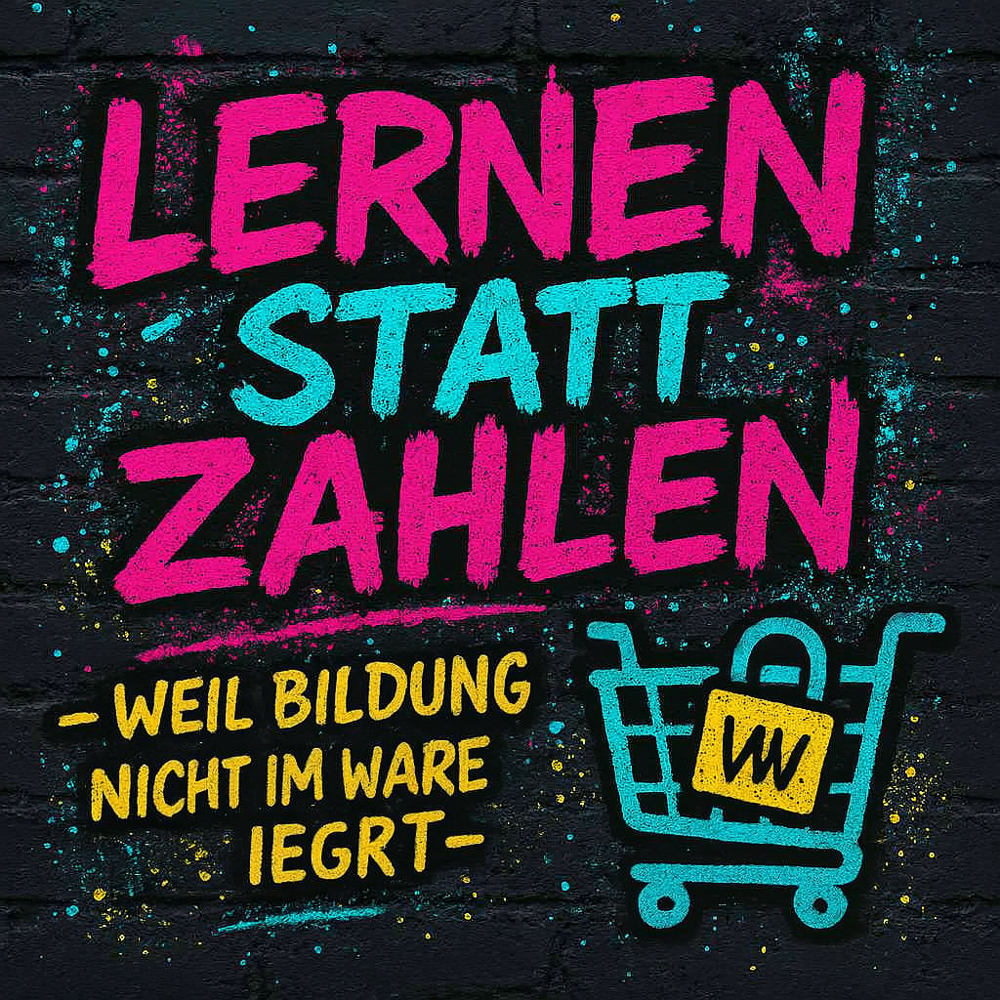

# Image-lernen-statt-zahlen

**Lernen statt zahlen – weil Bildung nicht im Warenkorb liegt.**

📌 **Verwendung:**  
Das Bild darf frei verwendet werden für nicht-kommerzielle Bildungsprojekte, Präsentationen oder Webseiten, die sich für offene Bildung einsetzen.

📁 **Dateien:**  
- `Banner-Warenkorb.jpeg`: Hauptbanner mit der Botschaft „Lernen statt zahlen“

# Lernen statt zahlen 🤓📝💸
Dieses Repository enthält visuelle Materialien, die für digitale Bildungsprojekte verwendet werden können.  
Das Banner ist Teil einer Initiative, die kostenlose und zugängliche Bildung fördert – unabhängig von Herkunft, Einkommen oder Status.

# Erlebnis statt zahlen 🎉
Viele wissen nicht, dass echtes Lernen kein Geld kosten muss.  
Dieses Projekt zeigt, wie man mit Neugier, Tools und Community frei lernen kann.

## 🚀 Ziel
Lernen soll ein Erlebnis sein, kein kaufbares Produkt.  
Hier entsteht eine Sammlung von freien Ressourcen, Ideen, Werkzeugen und man braucht nur den Verstand, sonst nichts.

## 📚 Inhalte (geplant)
- Freie Lernplattformen
- Open-Source-Tools
- Mindset & Motivation
- Mitmach-Möglichkeiten
- ein Lehrplan für wirklich jeden, der sich kostenlos was beibringen will
- mein Tagebuch, das täglich aktualisiert wird, mit dem was ich frei gelernt habe 

## 🛠️ Mitmachen
Ich bin ein Anfänger, und weiß wie stark eine Community sein kann. Es darf jeder mitmachen. Jeder ist willkommen egal welche Hautfarbe, Ethnie, egal ob ♀️oder ♂️ oder ⚧️. Ich setze nur gegenseitigen Respekt voraus– gemeinsam lernen wir besser.

## 🌱 Vision
Wissen gehört allen.  
Dieses Projekt wächst mit jedem Beitrag, jeder Frage und jedem Lernerlebnis.  
Lasst uns gemeinsam zeigen, dass Bildung frei sein kann – und Spaß macht.
